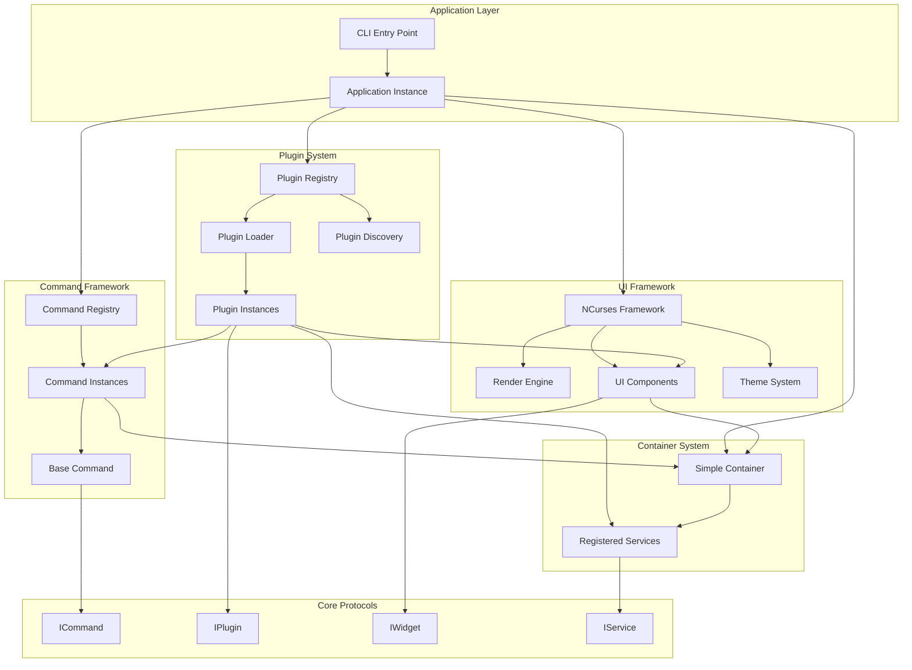
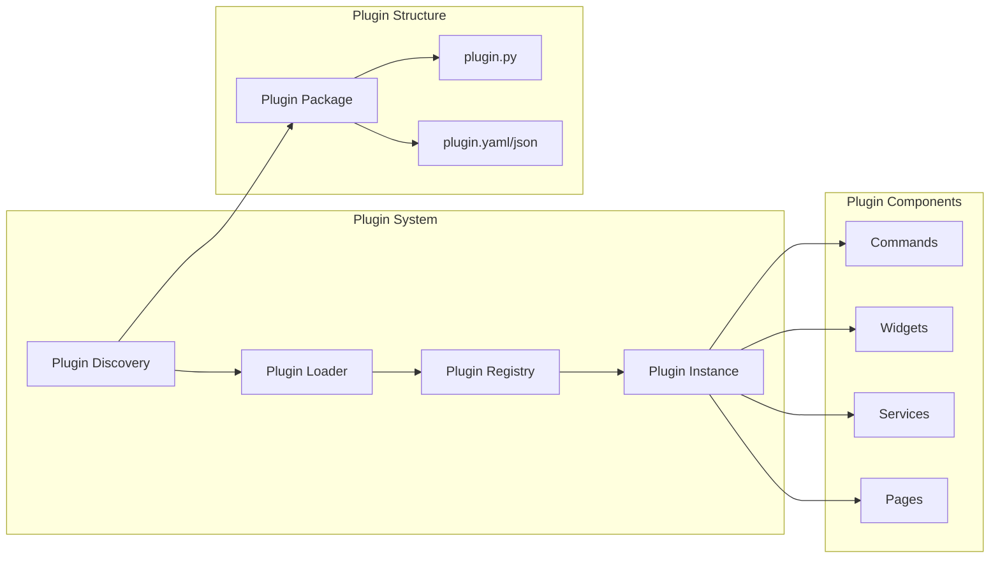
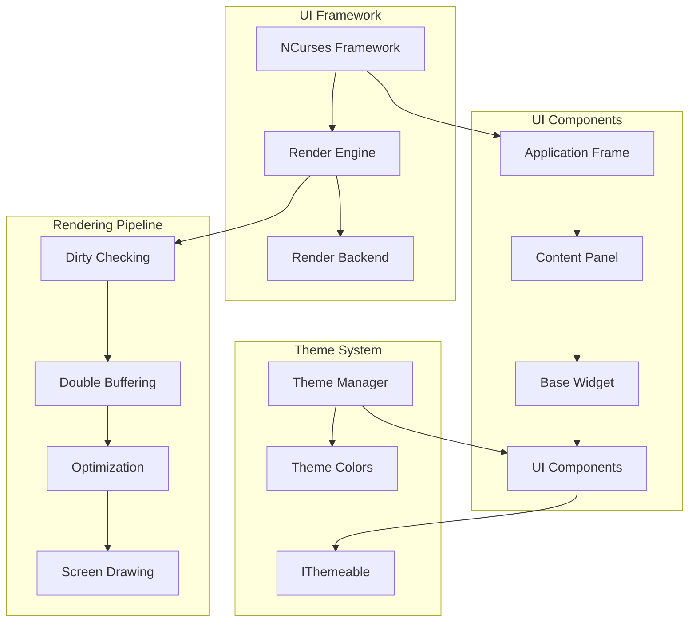
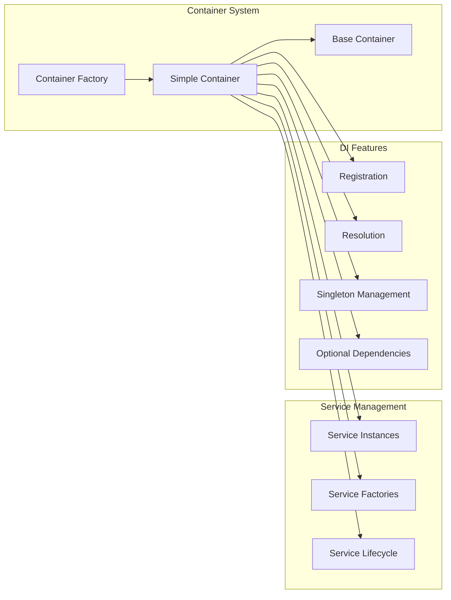
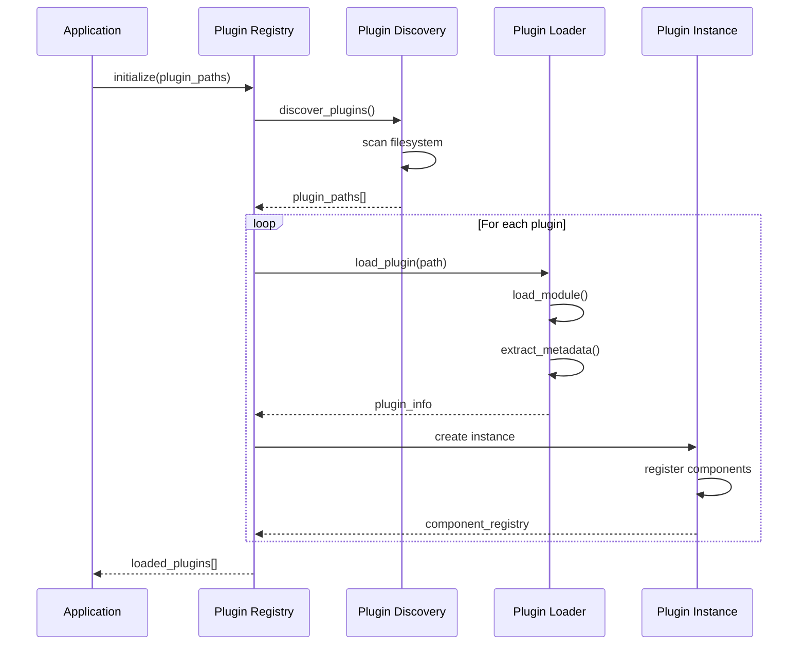
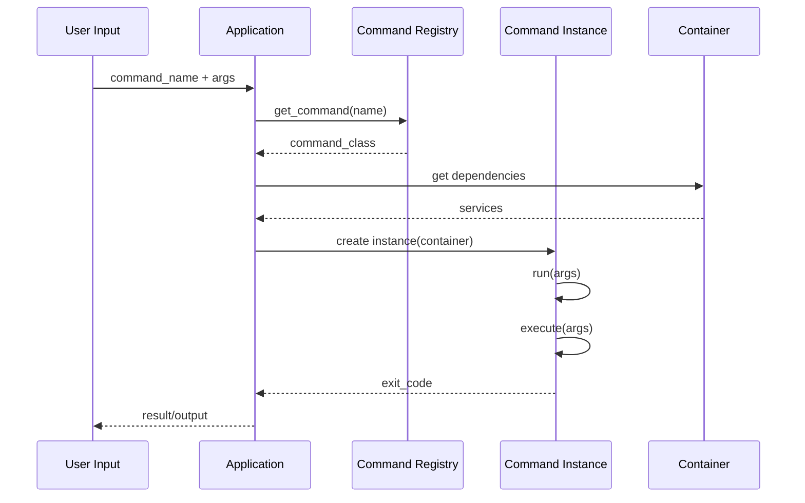
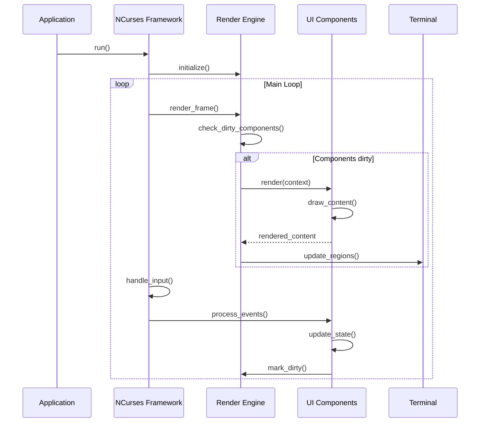

# Hyper Core Architecture

This document describes the high-level architecture of the Hyper Core framework, including the responsibilities of each system and how they interact with each other.

## Overview

Hyper Core is a modular, plugin-based CLI framework that provides terminal applications with ncurses UI support. The architecture follows separation of concerns with clear interfaces between components.



## System Components

### 1. Plugin System

The plugin system is responsible for discovering, loading, and managing plugins that extend the framework's functionality.



**Responsibilities:**
- **Plugin Discovery**: Scans filesystem for valid plugin packages
- **Plugin Loader**: Loads Python modules and extracts metadata
- **Plugin Registry**: Manages loaded plugins and their components
- **Plugin Instance**: Provides runtime access to plugin functionality

**Key Files:**
- `src/hyper_core/plugins/loader.py` - Core loading logic
- `src/hyper_core/plugins/registry.py` - Plugin management

### 2. Command Framework

The command framework provides the structure for CLI commands with dependency injection and error handling.

```mermaid
graph TB
    subgraph "Command Framework"
        CR[Command Registry]
        BC[Base Command]
        IC[ICommand Protocol]
    end
    
    subgraph "Command Lifecycle"
        Init[Initialize with Container]
        Run[run() - Error Handling]
        Exec[execute() - Core Logic]
        Exit[Return Exit Code]
    end
    
    subgraph "Command Features"
        Progress[Progress Indicators]
        Console[Rich Console Output]
        Validation[Input Validation]
        Helpers[Path/Port Helpers]
    end
    
    CR --> BC
    BC --> IC
    BC --> Init
    Init --> Run
    Run --> Exec
    Exec --> Exit
    BC --> Progress
    BC --> Console
    BC --> Validation
    BC --> Helpers
```

**Responsibilities:**
- **Command Registry**: Manages available commands
- **Base Command**: Provides common functionality and utilities
- **Error Handling**: Standardized exception handling and exit codes
- **Console Output**: Rich formatting and progress indicators

**Key Files:**
- `src/hyper_core/commands/base.py` - Base command implementation
- `src/hyper_core/commands/registry.py` - Command management

### 3. UI Framework

The UI framework provides ncurses-based terminal interfaces with modern rendering architecture.



**Responsibilities:**
- **NCurses Framework**: Main UI orchestration and event handling
- **Render Engine**: Optimized rendering with dirty checking
- **Components**: Reusable UI building blocks
- **Theme System**: Consistent visual styling

**Key Files:**
- `src/hyper_core/ui/framework.py` - Main framework
- `src/hyper_core/ui/engine.py` - Rendering engine
- `src/hyper_core/ui/components.py` - UI components

### 4. Container System

The container system provides dependency injection for plugins and components.



**Responsibilities:**
- **Simple Container**: Lightweight DI for basic needs
- **Service Registration**: Register instances and factories
- **Service Resolution**: Retrieve services with dependency resolution
- **Lifecycle Management**: Singleton patterns and cleanup

**Key Files:**
- `src/hyper_core/container/simple_container.py` - Main container implementation
- `src/hyper_core/container/base_container.py` - Advanced container features

## Data Flow

### Plugin Loading Flow



### Command Execution Flow



### UI Rendering Flow



## Plugin Integration Points

Plugins integrate with the framework through several well-defined interfaces:

1. **Command Integration**: Plugins provide command classes implementing `ICommand`
2. **Widget Integration**: Plugins provide widget classes implementing `IWidget`
3. **Service Integration**: Plugins provide service classes implementing `IService`
4. **Theme Integration**: Components implement `IThemeable` for styling

## Extension Points

The framework provides multiple extension points for customization:

- **Plugin Discovery**: Custom discovery mechanisms
- **Container Configuration**: Advanced DI setup
- **Theme Development**: Custom visual themes
- **Rendering Backends**: Alternative rendering systems
- **Command Parsers**: Custom argument parsing

## Performance Considerations

- **Lazy Loading**: Plugins and services loaded on-demand
- **Dirty Checking**: UI components only re-render when changed
- **Double Buffering**: Smooth terminal updates
- **Singleton Management**: Efficient service instantiation
- **Event-Driven Updates**: Minimal processing overhead