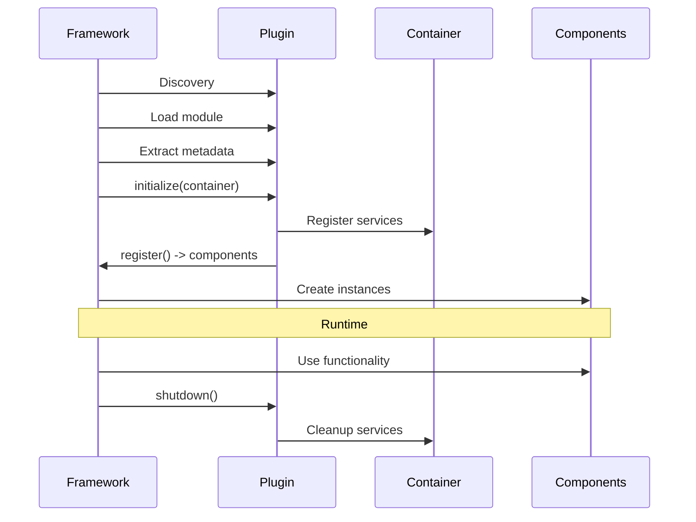

# Hyper Core Plugin Development Guide

This guide explains how to develop plugins for the Hyper Core framework, including plugin structure, available APIs, and best practices.

## Overview

Plugins extend Hyper Core functionality by providing:
- **Commands**: CLI commands for user interaction
- **Widgets**: UI components for dashboard interfaces
- **Pages**: Full-screen views in the menu system
- **Services**: Background services and utilities

## Plugin Structure

### Basic Plugin Package

Every plugin must be structured as a Python package:

```
my_plugin/
├── __init__.py          # Required: Makes it a Python package
├── plugin.py            # Required: Main plugin module
├── plugin.yaml          # Optional: Plugin metadata
├── commands/            # Optional: Command modules
│   ├── __init__.py
│   └── my_command.py
├── widgets/             # Optional: Widget modules
│   ├── __init__.py
│   └── my_widget.py
└── services/            # Optional: Service modules
    ├── __init__.py
    └── my_service.py
```

### Plugin Discovery

The framework searches for plugins in these locations:
- `./plugins/` (current directory)
- `~/.hyper/plugins/` (user home directory)
- Custom paths via `PluginLoader.add_search_path()`

### Plugin Metadata

Define plugin metadata in `plugin.py`:

```python
# plugin.py
PLUGIN_NAME = "my_plugin"
PLUGIN_VERSION = "1.0.0"
PLUGIN_DESCRIPTION = "My awesome plugin"
PLUGIN_AUTHOR = "Your Name"
PLUGIN_DEPENDENCIES = ["requests", "pyyaml"]  # Optional Python dependencies
```

Alternatively, use a `plugin.yaml` file:

```yaml
# plugin.yaml
name: my_plugin
version: 1.0.0
description: My awesome plugin
author: Your Name
dependencies:
  - requests
  - pyyaml
entry_points:
  commands:
    - MyCommand
  widgets:
    - MyWidget
  services:
    - MyService
```

## Creating Commands

Commands are the primary way users interact with your plugin functionality.

### Basic Command

```python
# plugin.py or commands/my_command.py
from hyper_core.commands import BaseCommand

class MyCommand(BaseCommand):
    """A simple example command."""
    
    @property
    def name(self) -> str:
        return "my-command"
    
    @property
    def description(self) -> str:
        return "Does something awesome"
    
    @property
    def help_text(self) -> str:
        return """
        Usage: my-command [options]
        
        This command demonstrates basic plugin functionality.
        
        Options:
            --verbose    Enable verbose output
            --config     Configuration file path
        """
    
    def execute(self, verbose: bool = False, config: str = None) -> int:
        """Execute the command logic."""
        if verbose:
            self.print_info("Running in verbose mode")
        
        if config:
            self.print_info(f"Using config file: {config}")
        
        # Your command logic here
        with self.show_progress("Processing", total=100) as (progress, task):
            for i in range(100):
                # Do work
                progress.update(task, advance=1)
        
        self.print_success("Command completed successfully!")
        return 0
```

### Advanced Command Features

#### Using Dependency Injection

```python
from rich.console import Console
from hyper_core.commands import BaseCommand

class AdvancedCommand(BaseCommand):
    def __init__(self, container):
        super().__init__(container)
        # Access injected services
        self.my_service = container.get(MyService)
    
    def execute(self) -> int:
        result = self.my_service.do_something()
        self.console.print(f"Result: {result}")
        return 0
```

#### Input Validation and Error Handling

```python
class ValidatedCommand(BaseCommand):
    def execute(self, port: str, directory: str) -> int:
        # Validate port
        if not self.validate_port(port):
            self.print_error(f"Invalid port: {port}")
            return 1
        
        # Validate directory
        dir_path = Path(directory)
        if not self.validate_path(dir_path, must_exist=True, must_be_dir=True):
            return 1
        
        # Check if port is available
        port_num = int(port)
        if not self.check_port_available(port_num):
            self.print_error(f"Port {port_num} is already in use")
            return 1
        
        # Command logic here
        return 0
```

### Subprocess Operations

BaseCommand provides robust subprocess integration for running external commands and tools:

#### Basic Subprocess Execution

```python
class SubprocessCommand(BaseCommand):
    def execute(self, build_target: str = "dev") -> int:
        # Run subprocess with output capture
        result = self.run_subprocess(
            ["npm", "run", "build", f"--mode={build_target}"],
            capture_output=True,
            show_output=True
        )
        
        if result.returncode == 0:
            self.print_success("Build completed successfully")
            
            # Access captured output
            stdout = self.get_captured_output()
            if "warnings" in stdout.lower():
                self.print_warning("Build completed with warnings")
            
            return 0
        else:
            self.print_error(f"Build failed with exit code {result.returncode}")
            return result.returncode
```

#### Streaming Subprocess Output

For long-running processes, use streaming to show real-time output:

```python
class StreamingCommand(BaseCommand):
    def execute(self, test_suite: str = "all") -> int:
        # Stream subprocess output in real-time
        with self.show_progress("Running tests"):
            result = self.run_subprocess_streaming(
                ["pytest", f"tests/{test_suite}", "-v"],
                cwd=self.get_project_root()
            )
        
        if result.returncode == 0:
            self.print_success("All tests passed!")
        else:
            self.print_error("Some tests failed")
            
        return result.returncode
```

#### Managing Subprocess Output

```python
class OutputManagementCommand(BaseCommand):
    def execute(self) -> int:
        # Clear any previous output
        self.clear_captured_output()
        
        # Run multiple commands and accumulate output
        commands = [
            ["git", "status", "--porcelain"],
            ["git", "log", "--oneline", "-5"],
            ["git", "branch", "-v"]
        ]
        
        for cmd in commands:
            result = self.run_subprocess(cmd, capture_output=True)
            if result.returncode != 0:
                self.print_error(f"Command failed: {' '.join(cmd)}")
                return result.returncode
        
        # Process all captured output
        all_output = self.get_captured_output()
        self.console.print(f"Git information:\n{all_output}")
        
        return 0
```

### Validation Utilities

BaseCommand includes utility methods for common validation tasks:

#### Port Validation

```python
class NetworkCommand(BaseCommand):
    def execute(self, port: str, host: str = "localhost") -> int:
        # Validate port format (string to int, range check)
        if not self.validate_port(port):
            self.print_error(f"Invalid port format: {port}")
            return 1
        
        port_num = int(port)
        
        # Check if port is available
        if not self.check_port_available(port_num, host):
            self.print_error(f"Port {port_num} is already in use on {host}")
            return 1
        
        self.print_success(f"Port {port_num} is available on {host}")
        return 0
```

#### Path and File Validation

```python
class FileCommand(BaseCommand):
    def execute(self, input_file: str, output_dir: str) -> int:
        input_path = Path(input_file)
        output_path = Path(output_dir)
        
        # Validate input file exists
        if not self.validate_path(input_path, must_exist=True, must_be_file=True):
            return 1
        
        # Ensure output directory exists (create if needed)
        if not self.ensure_directory(output_path):
            self.print_error(f"Could not create output directory: {output_path}")
            return 1
        
        # Validate output directory is writable
        if not self.validate_path(output_path, must_exist=True, must_be_dir=True):
            return 1
        
        # Get project root for relative path operations
        project_root = self.get_project_root()
        relative_input = input_path.relative_to(project_root)
        
        self.print_info(f"Processing {relative_input}")
        # File processing logic here
        
        return 0
```

### MCP Integration

BaseCommand automatically captures subprocess output for MCP (Model Context Protocol) clients, enabling AI tools to access command results:

#### Automatic Output Capture

```python
class MCPAwareCommand(BaseCommand):
    def execute(self, analyze: bool = False) -> int:
        # Output is automatically captured for MCP clients
        result = self.run_subprocess(["git", "log", "--oneline", "-10"])
        
        if analyze:
            # Additional analysis commands - output also captured
            self.run_subprocess(["git", "diff", "--stat"])
            self.run_subprocess(["git", "status", "--porcelain"])
        
        if result.returncode == 0:
            self.print_success("Git information collected")
            
            # MCP clients can access all captured output
            # No additional code needed - framework handles it
            return 0
        else:
            self.print_error("Failed to collect git information")
            return result.returncode
```

#### Manual Output Management for MCP

```python
class AdvancedMCPCommand(BaseCommand):
    def execute(self, command: str, clear_previous: bool = True) -> int:
        if clear_previous:
            # Clear any previous captured output
            self.clear_captured_output()
        
        # Run user-specified command
        result = self.run_subprocess(command.split(), capture_output=True)
        
        # Get captured output for processing
        output = self.get_captured_output()
        
        if "error" in output.lower():
            self.print_warning("Command output contains errors")
        
        # Output is available to MCP clients regardless of our processing
        return result.returncode
```

### Prompting for User Input

`BaseCommand` provides convenience helpers for interactive prompts so you don't
have to call `input()` directly.

```python
class InteractiveCommand(BaseCommand):
    def execute(self) -> int:
        name = self.prompt("Enter your name", default="Stranger")
        if self.prompt_confirm("Continue?", default=True):
            self.print_success(f"Hello {name}!")
        return 0
```

## Creating Widgets

Widgets provide visual components for terminal-based dashboard interfaces.

### Basic Widget

```python
# widgets/my_widget.py
from hyper_core.ui import BaseWidget, WidgetSize
from hyper_core.protocols import IWidget
import curses

class StatusWidget(BaseWidget):
    """Displays system status information."""
    
    def __init__(self, data_provider=None):
        super().__init__(
            title="System Status",
            size=WidgetSize.MEDIUM
        )
        self.data_provider = data_provider
        self.status_data = {"cpu": 0, "memory": 0, "disk": 0}
    
    def refresh_data(self) -> None:
        """Update widget data from data source."""
        if self.data_provider:
            self.status_data = self.data_provider.get_system_status()
    
    def draw_content(self, stdscr, x: int, y: int, width: int, height: int) -> None:
        """Render the widget content."""
        try:
            # Draw status information
            stdscr.addstr(y + 1, x + 2, f"CPU: {self.status_data['cpu']:.1f}%")
            stdscr.addstr(y + 2, x + 2, f"Memory: {self.status_data['memory']:.1f}%")
            stdscr.addstr(y + 3, x + 2, f"Disk: {self.status_data['disk']:.1f}%")
            
            # Color coding based on values
            for i, (key, value) in enumerate(self.status_data.items()):
                color = curses.COLOR_GREEN if value < 70 else \
                       curses.COLOR_YELLOW if value < 90 else curses.COLOR_RED
                stdscr.addstr(y + 1 + i, x + 2, f"{key.upper()}: ", 
                             curses.color_pair(1))
                stdscr.addstr(f"{value:.1f}%", curses.color_pair(color))
                
        except curses.error:
            # Handle terminal size issues gracefully
            pass
    
    def handle_input(self, key: int) -> bool:
        """Handle keyboard input when widget has focus."""
        if key == ord('r') or key == ord('R'):
            self.refresh_data()
            return True
        return False
    
    def get_minimum_size(self) -> tuple[int, int]:
        """Return minimum widget dimensions."""
        return (20, 6)  # width, height
```

### Interactive Widget

```python
class MenuWidget(BaseWidget):
    """Interactive menu widget with selection."""
    
    def __init__(self, items: list[str]):
        super().__init__(title="Menu", size=WidgetSize.MEDIUM)
        self.items = items
        self.selected_index = 0
    
    def handle_input(self, key: int) -> bool:
        """Handle navigation and selection."""
        if key == curses.KEY_UP and self.selected_index > 0:
            self.selected_index -= 1
            return True
        elif key == curses.KEY_DOWN and self.selected_index < len(self.items) - 1:
            self.selected_index += 1
            return True
        elif key == ord('\n'):  # Enter key
            self._on_item_selected(self.selected_index)
            return True
        return False
    
    def draw_content(self, stdscr, x: int, y: int, width: int, height: int) -> None:
        """Draw menu items with selection highlight."""
        for i, item in enumerate(self.items):
            if i >= height - 2:  # Don't exceed widget height
                break
            
            attrs = curses.A_REVERSE if i == self.selected_index else curses.A_NORMAL
            stdscr.addstr(y + 1 + i, x + 2, item[:width-4], attrs)
    
    def _on_item_selected(self, index: int) -> None:
        """Handle item selection - override in subclasses."""
        pass
```

## Creating Services

Services provide background functionality and shared resources.

### Basic Service

```python
# services/my_service.py
from hyper_core.protocols import IService
from typing import Dict, Any, Optional
import time

class DataProcessingService(IService):
    """Service for processing data in the background."""
    
    def __init__(self):
        self._initialized = False
        self._config = {}
        self._data_cache = {}
    
    @property
    def name(self) -> str:
        return "data_processing"
    
    @property
    def is_initialized(self) -> bool:
        return self._initialized
    
    def initialize(self, config: Optional[Dict[str, Any]] = None) -> None:
        """Initialize the service."""
        if self._initialized:
            return
        
        self._config = config or {}
        # Setup service resources
        self._setup_data_sources()
        self._initialized = True
    
    def shutdown(self) -> None:
        """Cleanup service resources."""
        self._data_cache.clear()
        self._initialized = False
    
    def health_check(self) -> Dict[str, Any]:
        """Perform health check."""
        return {
            'service': self.name,
            'healthy': self._initialized and self._check_data_sources(),
            'timestamp': time.time(),
            'cache_size': len(self._data_cache),
            'config': self._config
        }
    
    def get_status(self) -> Dict[str, Any]:
        """Get detailed status."""
        return {
            'service': self.name,
            'initialized': self._initialized,
            'timestamp': time.time(),
            'cache_entries': len(self._data_cache),
            'last_update': self._get_last_update_time()
        }
    
    # Service-specific methods
    def process_data(self, data: Any) -> Any:
        """Process data using service logic."""
        if not self._initialized:
            raise RuntimeError("Service not initialized")
        
        # Implementation here
        processed = self._transform_data(data)
        self._cache_result(data, processed)
        return processed
    
    def _setup_data_sources(self) -> None:
        """Setup internal data sources."""
        pass
    
    def _check_data_sources(self) -> bool:
        """Check if data sources are available."""
        return True
    
    def _transform_data(self, data: Any) -> Any:
        """Transform data logic."""
        return data
    
    def _cache_result(self, key: Any, result: Any) -> None:
        """Cache processing result."""
        self._data_cache[str(key)] = result
    
    def _get_last_update_time(self) -> float:
        """Get last update timestamp."""
        return time.time()
```

## Plugin Registration

### Manual Registration

```python
# plugin.py
from .commands.my_command import MyCommand
from .widgets.my_widget import StatusWidget
from .services.my_service import DataProcessingService

def register_plugin(container):
    """Register plugin components with the container."""
    # Register services
    service = DataProcessingService()
    container.register(DataProcessingService, service)
    
    # Commands and widgets are typically registered by the framework
    return {
        'commands': [MyCommand],
        'widgets': [StatusWidget],
        'services': [DataProcessingService]
    }
```

### IPlugin Interface

For advanced plugins, implement the `IPlugin` interface:

```python
from hyper_core.protocols import IPlugin
from typing import Dict, List, Any

class MyPlugin(IPlugin):
    """Full plugin implementation with IPlugin interface."""
    
    @property
    def name(self) -> str:
        return "my_plugin"
    
    @property
    def version(self) -> str:
        return "1.0.0"
    
    @property
    def description(self) -> str:
        return "My awesome plugin with full interface"
    
    def initialize(self, container: Any) -> None:
        """Initialize plugin with container access."""
        self.container = container
        # Setup plugin resources
        self._register_services()
    
    def register(self) -> Dict[str, List[Any]]:
        """Register all plugin components."""
        return {
            'commands': [MyCommand, AnotherCommand],
            'widgets': [StatusWidget, MenuWidget],
            'pages': [SettingsPage],
            'services': [DataProcessingService]
        }
    
    def shutdown(self) -> None:
        """Cleanup plugin resources."""
        # Cleanup logic here
        pass
    
    def _register_services(self) -> None:
        """Register services with the container."""
        service = DataProcessingService()
        self.container.register(DataProcessingService, service)
```

## Framework APIs

### Container Access

The framework provides dependency injection through containers:

```python
class MyCommand(BaseCommand):
    def __init__(self, container):
        super().__init__(container)
        
        # Get required services
        self.console = container.get(Console)
        self.my_service = container.get(MyService)
        
        # Get optional services
        optional_service = container.get_optional(OptionalService)
        if optional_service:
            self.use_optional_feature(optional_service)
```

### UI Rendering System

The framework provides a modern rendering engine:

```python
from hyper_core.ui.engine import UIComponent, RenderContext

class CustomComponent(UIComponent):
    def render(self, ctx: RenderContext) -> None:
        """Render component content."""
        # The framework handles dirty checking and optimization
        ctx.window.addstr(ctx.y, ctx.x, "Custom content")
    
    def get_size_hint(self) -> tuple[int, int]:
        """Return preferred size (width, height)."""
        return (40, 10)
```

### Theme Support

Make components themeable:

```python
from hyper_core.protocols import IThemeable
from hyper_core.ui.themes import Theme

class ThemedWidget(BaseWidget, IThemeable):
    def __init__(self):
        super().__init__()
        self.theme = None
    
    def set_theme(self, theme: Theme) -> None:
        """Apply theme to widget."""
        self.theme = theme
    
    def get_theme(self) -> Theme:
        """Get current theme."""
        return self.theme
    
    def draw_content(self, stdscr, x, y, width, height):
        """Draw with theme colors."""
        if self.theme:
            color = self.theme.colors.primary
            stdscr.addstr(y, x, "Themed content", curses.color_pair(color))
```

## Best Practices

### 1. Error Handling

BaseCommand provides comprehensive error handling with standardized exit codes:

```python
class RobustCommand(BaseCommand):
    def execute(self) -> int:
        try:
            # Command logic
            result = self.risky_operation()
            self.print_success(f"Operation completed: {result}")
            return 0  # Success
        except KeyboardInterrupt:
            # Ctrl+C handling - framework returns 130 automatically
            self.print_warning("Operation cancelled by user")
            raise  # Let framework handle the exit code
        except SpecificError as e:
            self.print_error(f"Specific error occurred: {e}")
            return 2  # Specific error code
        except Exception as e:
            self.print_error(f"Unexpected error: {e}")
            return 1  # General error
    
    def risky_operation(self):
        # Simulate operation that might fail
        import random
        if random.random() < 0.3:
            raise SpecificError("Something went wrong")
        return "success"

class SpecificError(Exception):
    pass
```

#### Exit Code Conventions

BaseCommand follows standard Unix exit code conventions:
- `0`: Success
- `1`: General error
- `2`: Specific/application error
- `130`: Interrupted by SIGINT (Ctrl+C) - handled automatically

#### Advanced Error Handling

```python
class DetailedErrorCommand(BaseCommand):
    def execute(self, strict: bool = False) -> int:
        errors = []
        
        try:
            self.validate_environment()
        except ValidationError as e:
            if strict:
                self.print_error(f"Validation failed: {e}")
                return 1
            else:
                errors.append(f"Warning: {e}")
        
        try:
            self.perform_operation()
        except OperationError as e:
            self.print_error(f"Operation failed: {e}")
            if errors:
                self.print_warning(f"Additional issues: {'; '.join(errors)}")
            return 2
        
        if errors:
            for error in errors:
                self.print_warning(error)
            self.print_info("Operation completed with warnings")
        else:
            self.print_success("Operation completed successfully")
        
        return 0
```

### 2. Configuration Management

```python
from pathlib import Path
import yaml

class ConfigurableCommand(BaseCommand):
    def __init__(self, container):
        super().__init__(container)
        self.config = self._load_config()
    
    def _load_config(self) -> dict:
        """Load plugin configuration."""
        config_path = Path.home() / ".hyper" / "my_plugin.yaml"
        if config_path.exists():
            with open(config_path) as f:
                return yaml.safe_load(f)
        return {}
```

### 3. Resource Management

```python
class ResourceAwareService(IService):
    def __init__(self):
        self.resources = []
    
    def initialize(self, config=None):
        """Initialize with proper resource management."""
        try:
            resource = self._acquire_resource()
            self.resources.append(resource)
        except Exception:
            self.shutdown()  # Cleanup on failure
            raise
    
    def shutdown(self):
        """Ensure all resources are released."""
        for resource in self.resources:
            try:
                resource.close()
            except Exception:
                pass  # Log but don't raise
        self.resources.clear()
```

### 4. Testing Your Plugin

```python
# tests/test_my_plugin.py
import pytest
from hyper_core.container import SimpleContainer
from my_plugin.commands.my_command import MyCommand

def test_my_command():
    """Test command execution."""
    container = SimpleContainer()
    command = MyCommand(container)
    
    result = command.execute()
    assert result == 0

def test_my_command_with_args():
    """Test command with arguments."""
    container = SimpleContainer()
    command = MyCommand(container)
    
    result = command.execute(verbose=True)
    assert result == 0
```

## Plugin Lifecycle



## Advanced Extension Points

For power users who need to extend BaseCommand beyond standard patterns:

### Lifecycle Hooks

```python
class LifecycleAwareCommand(BaseCommand):
    def run(self, *args, **kwargs) -> int:
        """Override run() to add pre/post execution hooks."""
        # Pre-execution setup
        self.clear_captured_output()  # Framework normally does this
        self.pre_execute_hook()
        
        try:
            # Call the standard execution flow
            result = super().run(*args, **kwargs)
            
            # Post-execution cleanup
            self.post_execute_hook(result)
            return result
        except Exception as e:
            self.on_execution_error(e)
            raise
    
    def pre_execute_hook(self) -> None:
        """Called before execute() method."""
        self.print_info("Initializing command execution")
    
    def post_execute_hook(self, result: int) -> None:
        """Called after execute() method."""
        if result == 0:
            self.print_info("Command execution completed successfully")
        else:
            self.print_warning(f"Command execution finished with code {result}")
    
    def on_execution_error(self, error: Exception) -> None:
        """Called when execute() raises an exception."""
        self.print_error(f"Command execution failed: {error}")
```

### Custom Output Capture

```python
class CustomCaptureCommand(BaseCommand):
    def __init__(self, container):
        super().__init__(container)
        self.custom_output = []
    
    def run_subprocess(self, cmd, **kwargs):
        """Override to add custom output processing."""
        result = super().run_subprocess(cmd, **kwargs)
        
        # Add custom metadata to captured output
        if hasattr(result, 'stdout') and result.stdout:
            self.custom_output.append({
                'command': cmd,
                'output': result.stdout,
                'timestamp': time.time(),
                'exit_code': result.returncode
            })
        
        return result
    
    def get_command_history(self) -> list:
        """Get history of all commands run by this instance."""
        return self.custom_output.copy()
```

### Advanced Console Integration

```python
class RichIntegrationCommand(BaseCommand):
    def execute(self) -> int:
        # Access Rich console directly for advanced formatting
        console = self.console
        
        # Create custom panels and layouts
        from rich.panel import Panel
        from rich.table import Table
        from rich.columns import Columns
        
        # Create a table with data
        table = Table(title="System Information")
        table.add_column("Component", style="cyan")
        table.add_column("Status", style="magenta")
        table.add_column("Details", style="green")
        
        table.add_row("Database", "Connected", "127.0.0.1:5432")
        table.add_row("Cache", "Running", "Redis 6.2.6")
        table.add_row("API", "Healthy", "Response time: 45ms")
        
        # Display in a panel
        console.print(Panel(table, title="Service Status", border_style="blue"))
        
        # Use progress context with custom styling
        with console.status("[bold green]Processing data...") as status:
            for i in range(10):
                status.update(f"[bold green]Processing item {i+1}/10...")
                time.sleep(0.1)
        
        return 0
```

### Dynamic Command Properties

```python
class DynamicCommand(BaseCommand):
    def __init__(self, container, command_name: str = None):
        super().__init__(container)
        self._dynamic_name = command_name
        self._dynamic_description = f"Dynamic command: {command_name}"
    
    @property
    def name(self) -> str:
        if self._dynamic_name:
            return self._dynamic_name
        return self._generate_default_name()  # Use framework's default naming
    
    @property
    def description(self) -> str:
        return self._dynamic_description
    
    def update_metadata(self, name: str, description: str) -> None:
        """Update command metadata dynamically."""
        self._dynamic_name = name
        self._dynamic_description = description
```

### Container Extension

```python
class ContainerExtensionCommand(BaseCommand):
    def __init__(self, container):
        super().__init__(container)
        
        # Register additional services during initialization
        self._register_runtime_services()
    
    def _register_runtime_services(self) -> None:
        """Register services that weren't available during plugin registration."""
        if not self.container.has(RuntimeService):
            service = RuntimeService()
            self.container.register(RuntimeService, service)
    
    def execute(self) -> int:
        # Access both pre-registered and runtime services
        runtime_service = self.container.get(RuntimeService)
        
        # Use service
        result = runtime_service.perform_operation()
        self.print_success(f"Runtime operation result: {result}")
        
        return 0

class RuntimeService:
    def perform_operation(self) -> str:
        return "Runtime service operation completed"
```

## Troubleshooting

### Common Issues

1. **Plugin not discovered**: Check directory structure and `__init__.py` files
2. **Import errors**: Ensure all dependencies are installed
3. **Service injection fails**: Verify service is registered in container
4. **UI rendering issues**: Check terminal size and curses error handling
5. **Subprocess output not captured**: Ensure `capture_output=True` in `run_subprocess()`
6. **MCP integration not working**: Check that commands are properly registered and inherit from BaseCommand

### Debugging

```python
import logging

# Enable debug logging
logging.basicConfig(level=logging.DEBUG)
logger = logging.getLogger(__name__)

class DebuggableCommand(BaseCommand):
    def execute(self) -> int:
        logger.debug("Starting command execution")
        
        # Debug subprocess execution
        result = self.run_subprocess(["echo", "test"], capture_output=True)
        logger.debug(f"Subprocess result: {result.returncode}")
        logger.debug(f"Captured output: {self.get_captured_output()}")
        
        # Debug container access
        try:
            service = self.container.get(MyService)
            logger.debug(f"Service accessed: {service}")
        except Exception as e:
            logger.debug(f"Service access failed: {e}")
        
        logger.debug("Command completed")
        return 0
```

### Performance Considerations

```python
class OptimizedCommand(BaseCommand):
    def execute(self, batch_size: int = 100) -> int:
        # Minimize subprocess calls by batching
        items = self.get_items_to_process()
        
        for i in range(0, len(items), batch_size):
            batch = items[i:i + batch_size]
            
            # Single subprocess call for batch
            batch_args = [str(item) for item in batch]
            result = self.run_subprocess(["process_batch"] + batch_args)
            
            if result.returncode != 0:
                self.print_error(f"Batch {i//batch_size + 1} failed")
                return result.returncode
        
        return 0
    
    def get_items_to_process(self) -> list:
        # Return items to process
        return list(range(1000))
```

## Examples

Check the `examples/` directory in the Hyper Core repository for complete plugin examples and templates.